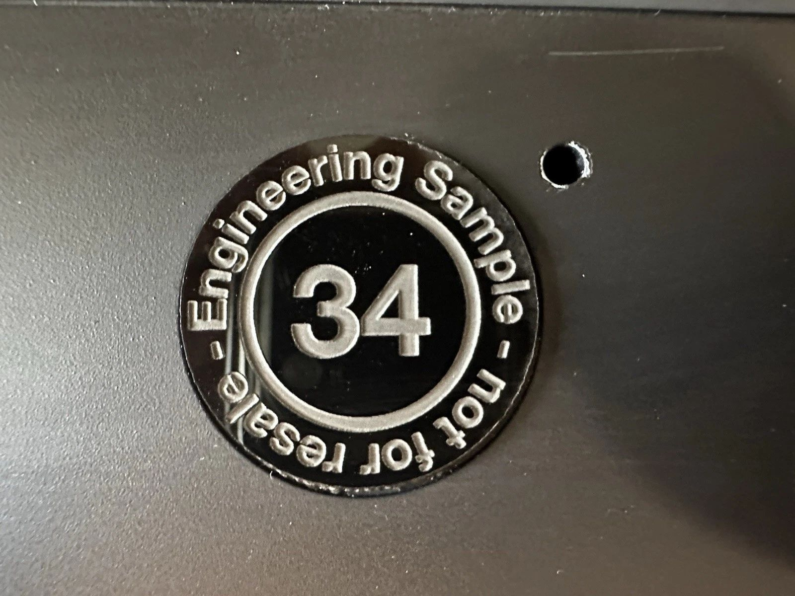

# Steam Deck Prototypes

## "Engineering Sample 34" Sold On Ebay

### Listing Details:
- Link (Most likely redirects to different Steam Deck listing): https://www.ebay.com/itm/277015390664
- Title: Early Valve Engineering 34 Prototype Steam Deck 256GB, Tested, Please Read!
- Seller: Storm_City_Retro
- Location: Kirkland, Washington, United States
- Returns: Seller does not accept returns.
- Asking Price: $3,000
- Sold At (Best Offer, Not Auction): $2,000
- Buyer: Unknown
- Description:
    - Valve engineering prototype number 34 steamdeck unit.
    - This appears to be a fairly early revision as it still has the circular touchpads and a right joystick versus an analog stick, this does not have any OS installed on it. It does howerever, have an installed 256GB NvME SSD.
    - The left touchpad is loose. That's how I got it. It looks like the two wires to run the viration feedback have been disconnected.
    - It only boot to bios no further testing done.
    - for futer questions, please reach out. I will answer the best I can thank you.
    - Due to the items rarity it will be shipped fully insured with signature required. Thank you.

### Additional Details
- ["A Steam Deck engineering prototype was just sold on eBay today for $3000 😭"](https://www.reddit.com/r/SteamDeck/comments/1jurheo/a_steam_deck_engineering_prototype_was_just_sold/) - Discussion on r/SteamDeck

## Media From Valve And An Employee

Source: https://www.steamdeck.com/en/press

Source: https://x.com/Plagman2/status/1569404939864264704

https://github.com/user-attachments/assets/8b3be78b-9893-4016-9451-8868e35487a8

Source: https://x.com/Plagman2/status/1569445637799956480
