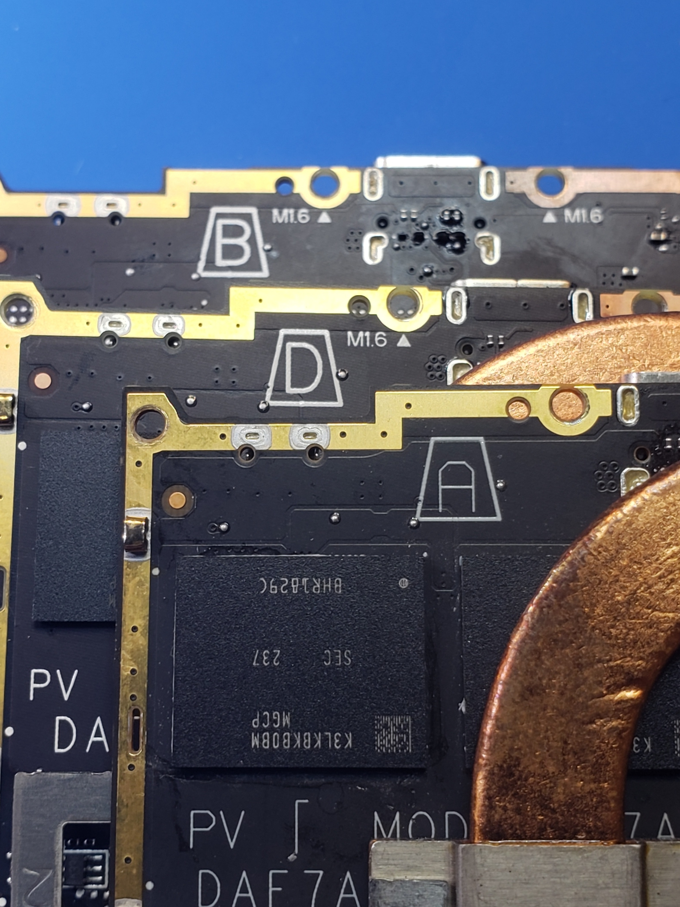
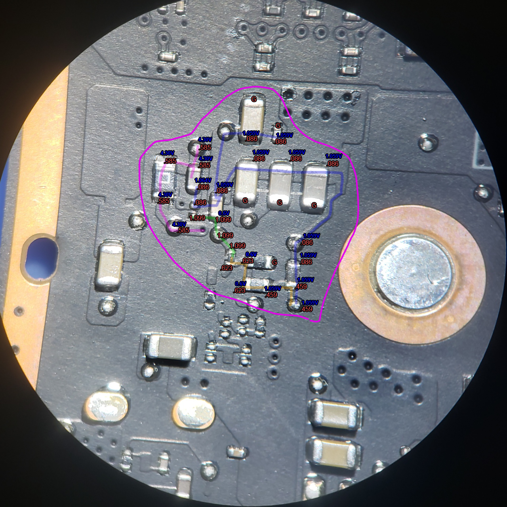
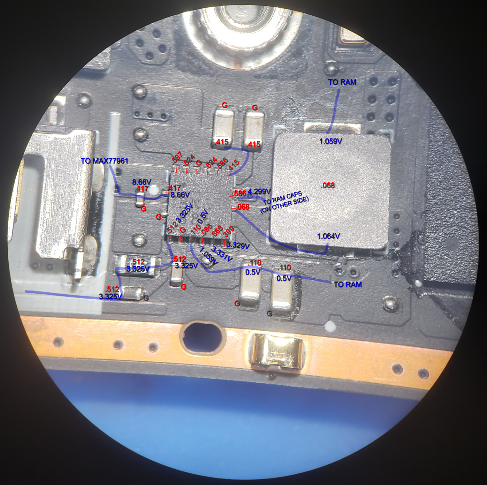
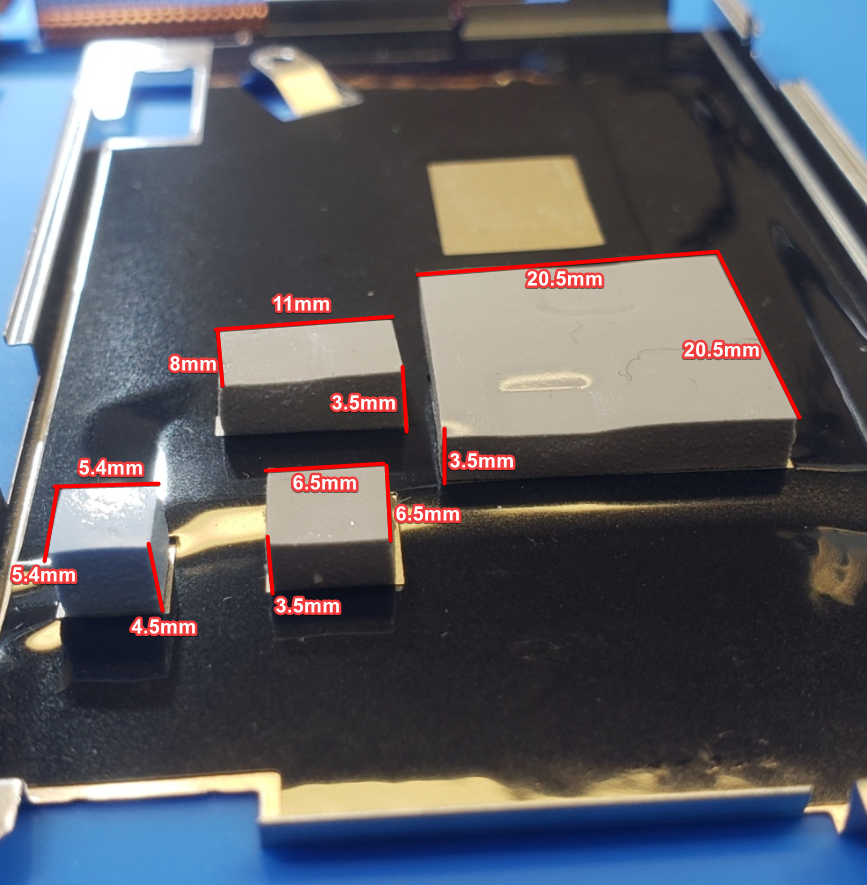
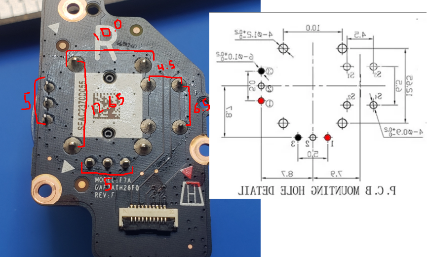
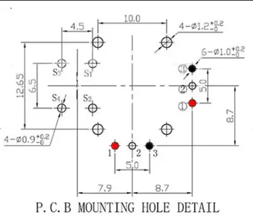
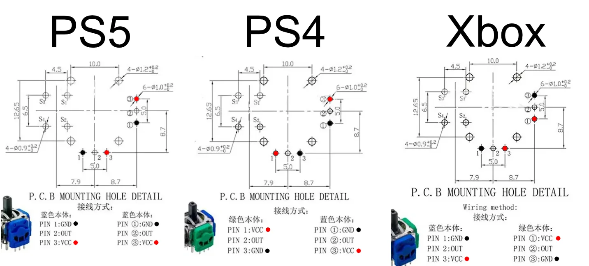

# Steam Deck LCD Parts And Measurements
[Back To Main File](../README.md)

## [Chip ID](https://www.ifixit.com/Guide/Steam+Deck+Chip+ID/147811)

## [Offical CAD Files](https://gitlab.steamos.cloud/SteamDeck/hardware)

## Main / Motherboard
- [USB-C Connector - 12402143E512A](https://www.amphenol-cs.com/product/12402143e512a.html)

### Different Revisions

### Panelization - [Explanation By PCBWay](https://www.pcbway.com/blog/PCB_Basic_Information/What_is_PCB_Panelization_PCB_Knowledge_eaf7e88f.html)

### Measurements

F7A Revision Pads  

### Diode Readings

### Traces

## Joystick

### Backside Of Right Joystick

### Joystick Pinouts & Distance Measurements

### Pinouts Only

### Other Controllers' Pinouts ([Source (?)](https://www.reddit.com/r/ConsoleRepairUK/comments/18i6al8/ps5_ps4_xbox_hall_effect_analog_stick_pinout/) - This Was Used For The Steam Deck Pinouts Edit)
