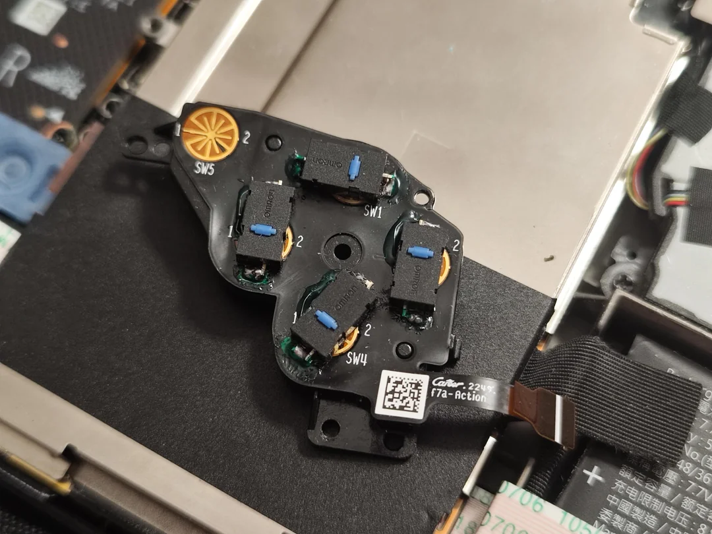

# Input Modifications

## Joysticks
- Make sure to calibrate after modification - [iFixit Steam Deck Joystick Calibration Guide](https://www.ifixit.com/Guide/How+to+Calibrate+Steam+Deck+Thumbsticks/150415)

### Hall Effect Joysticks
- Gulikit
    - [LCD version](https://www.gulikit.com/productinfo/1026071.html)
    - [OLED version](https://www.gulikit.com/productinfo/1215825.html)
    - Both have issues with outer deadzone being square
- ElecGear (Only For LCD)
    - Might have issues with deadzones?
    - Calibration issues when pressing joysticks in a certain way? (Read reviews)
- [More information about the two / comparison](https://www.reddit.com/r/SteamDeck/comments/15c4ppn/comment/jwfxsxt/)
- HandheldDIY (Only For OLED)
    - [Tight (Increased rotational resistance)](https://www.handhelddiy.com/products/steam-deck-oled-tighter-hall-joystick?variant=49363761430838)
    - [Standard](https://www.handhelddiy.com/products/steam-deck-oled-tighter-hall-joystick?variant=49363761398070)
    - Joystick caps have matte surface
    - Calibration on the joystick modules
    - No issues reported so far

### Custom Made Hall Effect / TMR Joystick (More info needed)
- Might be better solution compared to current hall effect offerings from Gulikit / Elecgear

### Joystick Cap Swap
- *Not Tested Yet - Basically OLED Joystick Caps Soldered To LCD Joystick Modules To Provide Better Grip And Look Better*
1. Buy OLED / LCD Hall Effect Sticks Depending On Witch One You Want (eg. Gulikit, sadly joystick caps only aren't available anywhere)
2. Desolder joystick caps from hall effect sticks
3. Desolder joystick caps from original sticks
4. Solder joystick caps from the hall effect stick to the original ones
5. Test if everything works correctly

### Joystick grips
- [Playvital](https://playvital.com/collections/steam-deck-thumb-grip)
- [Skull&Co.](https://skullnco.com/collections/steam-deck/products/thumb-grip-set-for-steam-deck)

### Silicone Joystick Protector Rings
- Benefits:
    - Multiple colors available for extra customization
    - Make sure to recalibrate after installing them
    - Sticks don't make noise hitting the shell
    - Stem won't have wear marks
    - Smooth movement remains
- [Playvital](https://playvital.com/collections/steam-deck-control-precision-rings)

### Xbox Elite 2 Joystick Module And Cap Swap
- [Tutorial](https://www.youtube.com/watch?v=qO3G0MXIltg)
- [Reddit Post](https://www.reddit.com/r/SteamDeckModded/comments/1bni7ro/swapped_standard_thumbstick_for_one_from_xbox/)
- Negatives:
    - Requires:
        - Desoldering stock joystick module
        - Spacers with different screws
        - Modifications to the back shell (Cutting)
    - Loses of capacitive touch
- Benefits:
    - Easily swappeable joystick caps
    - Adjustable tension for the joysticks

## Buttons

### Clicky Buttons
- [ExtremeRate Clicky Buttons (LCD & OLED)](https://extremerate.com/collections/for-steam-deck-clicky-kit)
    - [Sound and feeling can be changed to be a bit more quiet and less tactile by putting painters tape on the buttons](https://www.reddit.com/r/SteamDeckModded/comments/1hewzl7/achieving_a_quieter_tactile_buttons_dpad_w_the/)
    - 
- [DIY Method With Mouse Buttons (Cheaper too!)](https://www.reddit.com/r/SteamDeckModded/comments/1igzmr4/this_diy_clicky_buttons_mod_cost_me_2_bucks_but/)
    - [Video of how it sounds](https://imgur.com/a/MxtREr9)
    - Instructions:
        - Get mouse switches (eg. Omron, Kailh)
        - Take off flex board
        - Scrape off coating
        - Solder on the switches
            - Maybe put something (eg. copper sheet) behind the board for better heat transfer
        - Shave off edges on the buttons and brackets around the buttons on the shell
    - 

### Back Button Extensions
- [Playvital](https://playvital.com/collections/back-button-enhancement)
- [Skull&Co.](https://skullnco.com/collections/steam-deck/products/back-button-enhancement-set-for-steam-deck-4pcs)

### Trigger And Shoulder Button Extensions
- [Playvital](https://playvital.com/collections/steam-deck-triggers-extenders)

### Custom Power Button
- **Work in progress**

## Triggers
- Make sure to calibrate after modification - [iFixit Steam Deck Trigger Calibration Guide](https://www.ifixit.com/Guide/How+to+Calibrate+Steam+Deck+Triggers/150411)

### Dual Stage Triggers
- [3D printed parts + tactile switches](https://www.thingiverse.com/thing:6210987)
    - This model is only known to work with LCD Decks
- Similar Feeling To Steam Controller ("click" feedback on full press)
- Shouldn't interfere with trigger input values
- [Testing video (W.I.P - Uses modified model)](https://www.youtube.com/watch?v=8woKzJrXp88)

## Other

### Shell / Touchpad Grips
- [Playvital](https://playvital.com/collections/steam-deck-controller-grip)