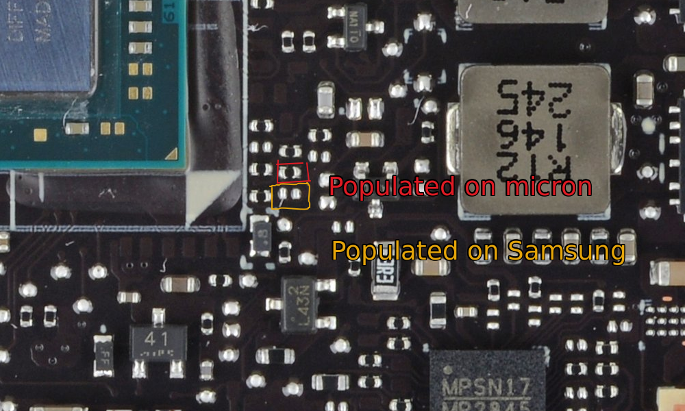

# Memory / RAM Upgrade
[Back To Main File](../../README.md)

## Requirements
- Knowledge about BGA soldering
- Proper tools for BGA soldering
- BIOS Patch:
    - Available in Steam Deck Discord
    - [Balika011's site (DeckHD + 32GB combination too)](http://balika011.hu/deck_32gb/)

### LCD Steam Deck
- Modding to 32GB is most common
- 48GB might be possible?
- Tested Modules:
    - Samsung 8GB LPDDR5X K3LKCKC0BM-MGCP (x4)

#### LCD Strap Resistor Diagram

### OLED Steam Deck
- RAM Modules are too hard to get(?)

#### OLED Strap Resistor Diagram

### [Video Explaining The Process (by dosdude1)](https://www.youtube.com/watch?v=nmobr6YEhWE)

### [Difference Between 16GB VS 32GB Deck (by Specter)](https://www.youtube.com/watch?v=yr_xtTxmBdo)