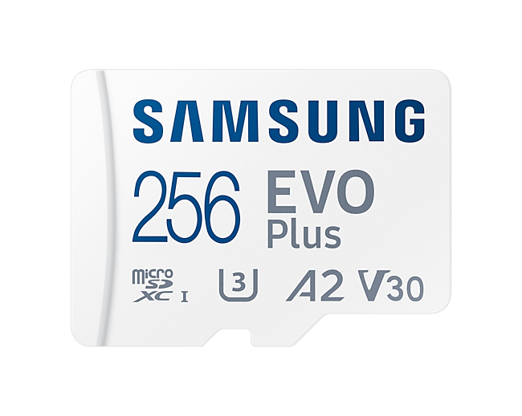

# Storage Modifications
[Back To Main File](../../README.md)

## Micro SD Card Guide
- UHS Speed Class 3 - U3
- Application Performance Class 2 - A2
- Slower cards might struggle with bigger games
- Commonly recommended brands:
    - Samsung
    - SanDisk
- Example for a good SD Card
    - 

## SSD Upgrade / Swap
- The SSD should be single sided, NVMe M.2 2230
- Lower power consumption is better
    - More battery life
    - Less heat
    - Less likely to cause issues with other components
