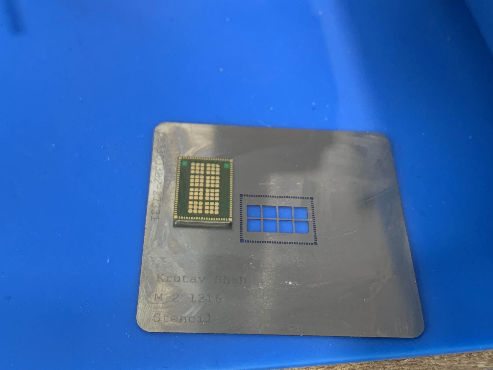

# Wireless Connectivity (Wifi And Bluetooth) Upgrade
[Back To Main File](../../README.md)

## Requirements
- Knowledge about SMT soldering
- Proper tools for SMT soldering

### LCD Deck
- Tested Modules:
    - Intel AX210D2W

### OLED Deck
- Already has much better connectivity compared to LCD Deck

### [Example Video Of Installation (by SlickBuys Mods and Repairs)](https://youtu.be/bOWyenE393E?si=GYUG47CjevSyDtmR&t=1133)

### [M.2 1216 Stencil (Compatible with AX210 and others...)](https://github.com/KrutavShah/M.2-1216-Stencil/)
