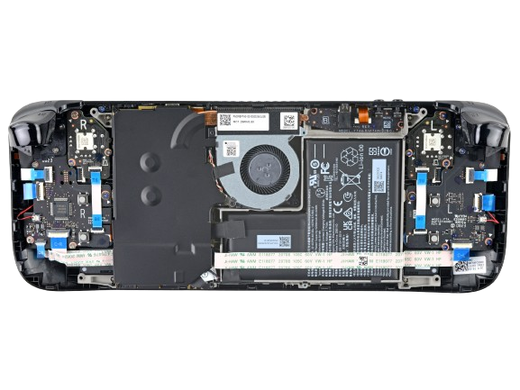

# Steam-Deck-Hardware
**Information and guides about Steam Deck hardware and modifications - [For software stuff click here](https://github.com/NKkrisz/Steam-Deck-Software)**  
**This project isn't associated with Valve and modifying your device will / may void your warranty.**  
**None of the links are affiliated in any way or are included because of external payment.**  
**If you're the owner of some content mentioned / contained in this repository and want it removed please [contact me (NKkrisz)](https://linktr.ee/nkkrisz)**

## 🧑‍💻 [How To Contribute To This Repository](./Markdown/Repository/Contribute.md) | [Credits And Sources](./Markdown/Repository/Credits.md) | [GitHub Repository](https://github.com/NKkrisz/Steam-Deck-Hardware)

## 💵 How To Support Me (NKkrisz) And This Repository
- Consider donating by clicking the button below:  
  
    - By doing so, I might be able to:
        - Get a second used / faulty LCD Deck
        - Upgrade to an OLED Deck which would enable further research
        - Buy more expensive hardware for testing, modifying or documenting Steam Deck stuff
- Contribute with new content or fix mistakes!

## 👥 Hardware Modding Communities / Resources
- [Steam Deck Discord - #hardware-mods channel](https://discord.gg/steamdeck)
- [r/SteamDeckModded Subreddit](https://www.reddit.com/r/SteamDeckModded/)
- [r/SteamDeck Subreddit](https://www.reddit.com/r/SteamDeck/)
- [Stanto's Website (Active Community Member On Steam Deck Discord)](https://www.stanto.com/)

## ⚠️ DISCLAIMER - READ FIRST BEFORE MODIFYING ANYTHING
- **Modifying your device will / may void your warranty!!!**
- **You can see your Deck's original parts here (Select matching serial number from the backplate):**
    - https://store.steampowered.com/account/hardwareused
- **VALVE RECOMMENDS PUTTING THE DEVICE INTO BATTERY STORAGE MODE FOR REPAIRS!!!**
    - [How to turn on battery storage mode](https://www.ifixit.com/Guide/How+to+Enable+Steam+Deck+Battery+Storage+Mode/149962)
        - **MAKE SURE THE BATTERY IS BELOW 80% BEFORE PUTTING IT INTO BATTERY STORAGE MODE, THE LOWER THE BETTER** (though full discharge isn't recommended)
- **TAKE OUT THE SD CARD BEFORE OPENING THE STEAM DECK OR IT WILL BREAK!!!**
- **DISCONNECT THE BATTERY AFTER TAKING OFF THE SHIELDING!!!**

## ⚙️ Different Steam Deck Releases, Revisions And Differences

### [Prototypes](./Markdown/Revisions/Prototypes.md)

### [Pre Mass Production](./Markdown/Revisions/Pre_Mass_Production.md)

### LCD Version
- Easily differentiable older / newer revision by looking at shielding above the motherboard

| | **Older model (beginning of EV3) and an early model (EV2, some early dev kits)** |
|---|---|
| | **Newer revision with black shielding and other changes** |

### OLED Version

| | **Stock OLED (2024. November purchase) - Some smaller changes are being introduced (eg. SK Hynix RAM?)** |
|---|---|
| | **Transparent Black Limited Edition (only some accents and shell different)** |
|---|---|
| | **White Limited Edition - Some smaller changes are being introduced** |

### More Information About Both Can Be Found Here
- [LCD Deck Specifications](https://www.steamdeck.com/en/tech/deck)
- [OLED Deck Specifications](https://www.steamdeck.com/en/tech/oled)
- [LCD Deck Revisions And Differences](./Markdown/Revisions/LCD_Revisions.md)
- [OLED Deck Revisions And Differences](./Markdown/Revisions/OLED_Revisions.md)
- [Comparison Video Between LCD And OLED Deck Components](https://www.youtube.com/watch?v=9jhRh11bTRA)
- [Comparison Video Between LCD And OLED Deck Input Lag](https://www.youtube.com/watch?v=LkrV6VlGPIE)
- [Analysis of LCD PWM Flicker & Visual Fatigue](https://www.reddit.com/r/SteamDeck/comments/17yf90o/analysis_of_the_pwm_of_the_steam_deck_lcd_screen/)
- [Analysis of OLED PWM Flicker & Visual Fatigue](https://www.reddit.com/r/SteamDeck/comments/1882kys/analysis_of_the_pwmflickervisual_fatigue_of_the/)

## [🧰 Recommended Tools For Repairing / Modding](./Markdown/Other/Tools.md)

## ✨ Cosmetic Upgrades

### Full Shell Or Backplate Swap
- [Transform LCD Deck Frontplate to fit a OLED Steam Deck](https://www.reddit.com/r/SteamDeckModded/comments/1fhc8zu/how_to_transform_a_lcd_frontplate_to_fit_a_oled/)
- [ExtremeRate](https://extremerate.com/collections/steam-deck-shells)
- [Jsaux](https://jsaux.com/collections/transparent-cover)

### Inputs
- [Custom 3D Printable Action Buttons And D-Pad](https://www.printables.com/model/925407-steam-deck-action-buttons-and-d-pad)
- [ExtremeRate Colored & Transparent Buttons](https://extremerate.com/collections/steam-deck-buttons)
- [Deck Buttons - Resin, Metal etc... Buttons](https://deckbuttons.com/)
- Etsy stores' resin or other buttons
- [Joystick Cap Painting](https://www.youtube.com/watch?v=TbqEUB3BqjA)

### Skins / Stickers

## 🪛 Hardware Upgrades

- ### [Wireless Connectivity (Wifi And Bluetooth)](./Markdown/Mods/Wireless.md)
- ### [Storage (SSD And MicroSD)](./Markdown/Mods/Storage.md)
- ### [Screen & Screen Protectors](./Markdown/Mods/Screen.md)
- ### [Tracking Device (eg. AirTag)](https://www.reddit.com/r/SteamDeck/comments/1aojmq8/added_a_slim_airtag_to_my_steam_deck/)
- ### [Memory / RAM](./Markdown/Mods/Memory.md)
- ### [External GPU](https://www.reddit.com/r/SteamDeck/comments/1eqh47y/franken_deck_abomination/)
- ### [Dual Battery](https://www.reddit.com/r/SteamDeck/comments/15r2ffl/steam_deck_duel_battery_upgrade/)
- ### [Dual Screen](https://www.reddit.com/r/SteamDeckModded/comments/1en98vt/my_take_on_dual_screen/)
- ### [Cooling](./Markdown/Mods/Cooling.md)
- ### [Rumble](https://github.com/dawidmpunkt/rumble-for-steamdeck)
- ### [Inputs](./Markdown/Mods/Inputs.md)

## 🕹️ Accessories
- [DeckMate - Backplate Addons](https://getmechanism.com/collections/shop-mechanism/deckmate)
- Docks
    - [Valve's Steam Deck Dock](https://www.steamdeck.com/en/dock)
        - Gets firmware updates from Valve
        - Comes with another Steam Deck charger
        - Most likely needs an adapter if used with a case on (USB extension or fitment fix)
        - Example adapter: [Project Killswitch - Steam Deck Dock Adapter From Dbrand](https://www.printables.com/model/411302-project-killswitch-steam-deck-dock-adapter)
    - Any brand should work but it's recommended to at least have USB-C PD (Power Delivery) so the Deck remains charged
- Cases
    - Stock / Original (Older ones had strap, different models are differently colored, 1TB OLED has a removable inner case)
    - [Dbrand - Project Killswitch](https://dbrand.com/shop/grip/steam-deck-cases)
    - Jsaux
        - [Modcase](https://jsaux.com/products/modcase-for-steam-deck-pc0104)
        - [Protective Standing Case](https://jsaux.com/products/upgraded-protective-standing-case-for-steam-deck-pc0105)
    - [Spigen - Rugged Armor](https://www.spigen.com/collections/steam-deck/products/steam-deck-series-case-rugged-armor)
    - [Tomtoc - Armor-G12](https://www.tomtoc.com/products/armor-g12-steam-deck-case)
    - [Mepatem - 3 in 1 Case](https://www.amazon.com/dp/B0BRKWWJJ5)
- Chargers
    - Official / Stock:
        - Power Output: 45W
        - Length: 1.5m (LCD) or 2.5m (OLED) (Both are compatible with any Steam Decks)
        - USB-C PD3.0
        - Non-removable cable
    - Recommendations / guidelines:
        - 45W+ Output (If less the Deck might discharge during gaming)
        - Needs USB PD (Power Delivery)
        - Removable cable (To carry around any length needed)
    - Extra Strain Relief Solutions:
        - USB-C 90 / 180 Degree Adapters
        - [3D Printed Cable Relief](https://www.printables.com/model/218771-steam-deck-cable-strain-relief)
    - [Additional information about battery and charging](https://www.reddit.com/r/SteamDeck/comments/ub0ai4/a_few_important_things_about_charging_the_deck/)

## 🎮 Fully Transformed Steam Deck Examples
- [RAM, Wifi, Shell, Joystick And Screen Upgrade](https://www.youtube.com/watch?v=HW1yAWZjGrk)
    - Possible OLED Screen Swap For LCD Decks In The Future?
- [Tablet / Switch Mod](https://www.reddit.com/r/SteamDeckModded/comments/17q4y8q/steamdeck_tablet_mod_and_3d_files_stl_and_step/)
- [Bondi Blue iMac G3](https://www.reddit.com/r/SteamDeckModded/comments/1ev57jz/i_turned_my_deck_into_a_bondi_blue_imac_g3_from/)
- [Giant 4K Screen](https://www.reddit.com/r/SteamDeck/comments/177ffd8/my_13inch_4k_oled_steam_deck/)
- [Half Life Edition](https://www.reddit.com/r/SteamDeckModded/comments/1dd7ymu/steamdeck_oled_half_life_ver/)
- [Portal Edition](https://www.reddit.com/r/SteamDeckModded/comments/1bib04o/introducing_the_steam_deck_oled_portal_edition/)
- [Fully Red](https://www.reddit.com/r/SteamDeck/comments/1cialbj/great_never_again/)
- [GabeCube](https://www.reddit.com/r/SteamDeck/comments/1crzpaq/my_gabecube_is_finally_complete_switch_2_looking/)

## 🧑‍🔧 Troubleshooting, Repair Guides, Parts And Measurements
- [Steam Support - Basic Use & Troubleshooting Guide](https://help.steampowered.com/en/faqs/view/69E3-14AF-9764-4C28)
- [iFixit - Steam Deck LCD Repair Guides](https://www.ifixit.com/Device/Steam_Deck)
- [Steam Deck LCD Parts And Measurements](./Markdown/Parts/LCD_Parts.md)
- [iFixit - Steam Deck OLED Repair Guides](https://www.ifixit.com/Device/Steam_Deck_OLED)
- [Steam Deck OLED Parts And Measurements](./Markdown/Parts/OLED_Parts.md)
- [Fixes For Other Issues](./Markdown/Other/Fixes.md)
- [Repair Wiki](https://repair.wiki/w/Steam_Deck)

## 🛠️ Replacement Parts

### [iFixit (Official Valve partner)](https://store.steampowered.com/news/app/1675200/view/3216144458749237711)
- [iFixit US](https://www.ifixit.com/Parts/Steam_Deck)
- [iFixit EU](https://eustore.ifixit.com/collections/steam-deck-parts)
- [iFixit AUS](https://australia.ifixit.com/collections/steam-deck-parts)

### Do note that not everything is available in iFixit's stores, this includes:
- Trackpads
- Mother / Daughterboards
- Ribbon Cables
- Inner Screws (Backplate ones are available)
- Original / Stock Carrying Cases

## 👀 Interesting Stuff
- [Quanta Computer is the manufacturer of Steam Decks (See 3rd picture, top-left print on box, Valve is also mentioned on their wiki)](https://store.steampowered.com/news/app/1675180/view/2963920750895461227)
- Steam Decks' brown cardboard shipping boxes have Valve references on them
- In Japan the boxes that Steam Decks come in are different and have proper retail packaging and design
- [You can wake up a docked Steam Deck (LCD too) with the Steam Controller](https://www.reddit.com/r/SteamDeck/comments/15c6h2x/you_can_wake_up_a_docked_steam_deck_with_the/)
- [How The Giant Steam Deck Was Made For The Tokyo Game Show (2022)](./Markdown/Other/Giant_Steam_Deck_TGS_2022.md)
- [Steam Deck RGB Mod - Part 1 - I2C Investigation - CalcProgrammer1](https://www.youtube.com/watch?v=CzuZNvp0MOQ)
- [Steam Deck Chip Deep-Dive (Van Gogh/Aerith) - High Yield](https://www.youtube.com/watch?v=ERm1StY-4uY)
- [Steam Deck Buttons And Joystick Mod For The Steam Controller](https://www.reddit.com/r/SteamControllerMods/comments/1erquuf/update_on_steam_deck_face_button_mod/) - [Tutorial](https://www.reddit.com/r/SteamControllerMods/comments/1exfzic/steam_controller_with_steam_deck_oled_face_button/)
 
## 📜 TODO
- Update old / add new info into Markdown files:
    - Carrying Cases
    - Other things...
- Get pictures of all LCD & OLED components (all sides)
- Get more video footage of certain mods (eg. clicky buttons, dual-stage triggers)
- Add images of packaging (worldwide and Japanese versions)
- Remove background of Steam Deck revision pictures manually
- Separate EV2 and early production LCD Steam Decks in comparison table
- Add info about more cooling mods (better fan, better heatsink, liquid cooling)
- Add info about stiffer / stronger trigger mod (different / combination of springs)
- DIY Hall-effect / TMR joysticks research and testing
- OLED battery swap into LCD Deck? ([Currently doesn't work](https://www.ifixit.com/Answers/View/823192/Could+I+put+the+new+Steam+Deck+OLED+battery+into+the+original+Deck))
- Type A (MEDA) vs Type B (MHDA) LCD joysticks comparison ([difference in capacitive touch and microcontroller?](https://www.ifixit.com/Guide/Steam+Deck+Left+Thumbstick+Replacement/148896))
- Compile useful commands and tips for hardware modding
- Get more info about panel types (BOE, Samsung etc...)
- Get a list of all stock SSDs used in Steam Decks
- Redo file structure (better management for images)
- Optimize images to be smaller in file size for faster loading