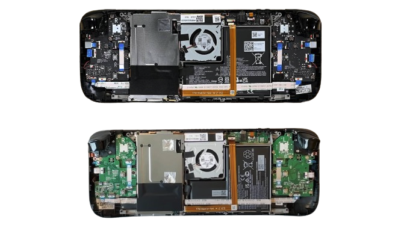

# Steam-Deck-Hardware
**Information and guides about Steam Deck hardware and modifications.**  
**This project isn't associated with Valve and modifying your device will / may void your warranty.**  
**None of the links are affiliated in any way or are included because of external payment.**

## 🧑‍💻 [How To Contribute To This Repository](Markdown/Contributing.md) | [Credits And Sources](Markdown/Credits.md)

## 💵 How To Support Me (NKkrisz) And This Repository
- Consider donating by clicking the button below:  
  
- By doing so, I might be able to:
    - Get a second used / faulty LCD Deck
    - Upgrade to an OLED Deck which would enable further research
    - Buy more expensive hardware for testing or for modifying Steam Decks

## 👥 Hardware Modding Communities / Resources
- [r/SteamDeckModded Subreddit](https://www.reddit.com/r/SteamDeckModded/)
- [r/SteamDeck_2 Subreddit](https://www.reddit.com/r/SteamDeck_2/)
- [Steam Deck Discord - #hardware-mods channel](https://discord.gg/steamdeck)
- [Stanto's Website (Active Community Member On Steam Deck Discord)](https://www.stanto.com/)

## ⚠️ DISCLAIMER - READ FIRST BEFORE MODIFYING ANYTHING
- **Modifying your device will / may void your warranty!!!**
- **You can see your Deck's original parts here (Select matching serial number from the backplate):**
    - https://store.steampowered.com/account/hardwareused
- **VALVE RECOMMENDS PUTTING THE DEVICE INTO BATTERY STORAGE MODE FOR REPAIRS!!!**
    - [How to turn on battery storage mode](https://www.ifixit.com/Guide/How+to+Enable+Steam+Deck+Battery+Storage+Mode/149962)
        - **MAKE SURE THE BATTERY IS BELOW 80% BEFORE PUTTING IT INTO BATTERY STORAGE MODE, THE LOWER THE BETTER** (though full discharge isn't recommended)
- **TAKE OUT THE SD CARD BEFORE OPENING THE STEAM DECK OR IT WILL BREAK!!!**
- **DISCONNECT THE BATTERY AFTER TAKING OFF THE SHIELDING!!!**

## ⚙️ Different Steam Deck Options, Revisions And Differences

### LCD Version
- Easily differentiable older / newer revision by looking at shielding above the motherboard

| | **Older model and Valve's pre mass production model** |
|---|---|
| | **Newer revision with black shielding and other changes** |

### OLED Version
- No known revisions yet (?)

### More Information About Both Can Be Found Here
- [LCD Deck Specifications](https://www.steamdeck.com/en/tech/deck)
- [OLED Deck Specifications](https://www.steamdeck.com/en/tech/oled)
- [LCD Deck revisions and differences](Markdown/LCD_Revisions.md)
- [OLED Deck revisions and differences](Markdown/OLED_Revisions.md)
- [Comparison video between LCD and OLED Deck hardware by Gamers Nexus](https://www.youtube.com/watch?v=9jhRh11bTRA)

## [🧰 Recommended Tools For Repairing / Modding](Markdown/Tools.md)

## 🛠️ Replacement Parts

### [iFixit (Official Valve partner)](https://store.steampowered.com/news/app/1675200/view/3216144458749237711)
- [iFixit US](https://www.ifixit.com/Parts/Steam_Deck)
- [iFixit EU](https://eustore.ifixit.com/collections/steam-deck-parts)
- [iFixit AUS](https://australia.ifixit.com/collections/steam-deck-parts)

## ✨ Cosmetic Upgrades

### Full Shell Or Backplate Swap
- [ExtremeRate](https://extremerate.com/collections/steam-deck-shells)
- [Jsaux](https://jsaux.com/collections/transparent-cover)

### Inputs
- [ExtremeRate colored & transparent buttons](https://extremerate.com/collections/steam-deck-buttons)
- Etsy stores' resin or other buttons
- [Joystick Cap Painting](https://www.youtube.com/watch?v=TbqEUB3BqjA)

### Skins / Stickers

## 🪛 Hardware Upgrades

### [Wireless Connectivity (Wifi And Bluetooth)](Markdown/Wireless.md)

### [Storage (SSD And MicroSD)](Markdown/Storage.md)

### [Screen & Screen Protectors](Markdown/Screen.md)

### [Tracking Device (eg. AirTag)](https://www.reddit.com/r/SteamDeck/comments/1aojmq8/added_a_slim_airtag_to_my_steam_deck/)

### [Memory / RAM](Markdown/Memory.md)

### [External GPU](https://www.reddit.com/r/SteamDeck/comments/1eqh47y/franken_deck_abomination/)

### [Dual Battery](https://www.reddit.com/r/SteamDeck/comments/15r2ffl/steam_deck_duel_battery_upgrade/)

### [Dual Screen](https://www.reddit.com/r/SteamDeckModded/comments/1en98vt/my_take_on_dual_screen/)

### [Cooling](Markdown/Cooling.md)

### [Rumble](https://github.com/dawidmpunkt/rumble-for-steamdeck)

### [Inputs](Markdown/Inputs.md)

## 🕹️ Other Accessories
- [DeckMate - Backplate Extensions](https://getmechanism.com/collections/shop-mechanism/deckmate)
- Back Button Extensions
    - [Playvital](https://playvital.com/collections/back-button-enhancement)
    - [Skull&Co.](https://skullnco.com/collections/steam-deck/products/back-button-enhancement-set-for-steam-deck-4pcs)
- Trigger And Shoulder Button Extensions
    - [Playvital](https://playvital.com/collections/steam-deck-triggers-extenders)
- Joystick grips
    - [Playvital](https://playvital.com/collections/steam-deck-thumb-grip)
    - [Skull&Co.](https://skullnco.com/collections/steam-deck/products/thumb-grip-set-for-steam-deck)
- Shell / Touchpad Grips
    - [Playvital](https://playvital.com/collections/steam-deck-controller-grip)
- Silicone Joystick Rings
    - [Playvital](https://playvital.com/collections/steam-deck-control-precision-rings)
- Docks
    - [Valve's Steam Deck Dock](https://www.steamdeck.com/en/dock)
        - Most likely needs an adapter if used with a case on
        - Example adapter: [Project Killswitch - Steam Deck Dock Adapter From Dbrand](https://www.printables.com/model/411302-project-killswitch-steam-deck-dock-adapter)

## 🎮 Fully Transformed Steam Deck Examples
- [RAM, Wifi, Shell, Joystick And Screen Upgrade](https://www.youtube.com/watch?v=HW1yAWZjGrk)
    - Possible OLED Screen Swap For LCD Decks In The Future?
- [Tablet / Switch Mod](https://www.reddit.com/r/SteamDeckModded/comments/17q4y8q/steamdeck_tablet_mod_and_3d_files_stl_and_step/)
- [Giant 4K Screen](https://www.reddit.com/r/SteamDeck/comments/177ffd8/my_13inch_4k_oled_steam_deck/)
- [Half Life Edition](https://www.reddit.com/r/SteamDeckModded/comments/1dd7ymu/steamdeck_oled_half_life_ver/)
- [Portal Edition](https://www.reddit.com/r/SteamDeckModded/comments/1bib04o/introducing_the_steam_deck_oled_portal_edition/)
- [Fully Red](https://www.reddit.com/r/SteamDeck/comments/1cialbj/great_never_again/)
- [GabeCube](https://www.reddit.com/r/SteamDeck/comments/1crzpaq/my_gabecube_is_finally_complete_switch_2_looking/)

## 🧑‍🔧 Troubleshooting And Repair Guides
- [Steam Support - Basic Use & Troubleshooting Guide](https://help.steampowered.com/en/faqs/view/69E3-14AF-9764-4C28)
- [iFixit - Steam Deck LCD Repair Guides](https://www.ifixit.com/Device/Steam_Deck)
- [iFixit - Steam Deck OLED Repair Guides](https://www.ifixit.com/Device/Steam_Deck_OLED)
